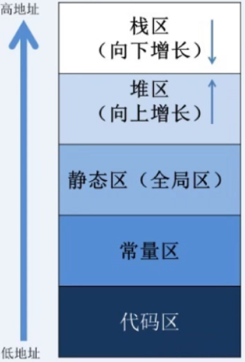

static 是C++的一个关键字，它被用来控制变量的存储方式和可见性
<!-- more -->
# 程序在内存中的模型
首先，一个完成的程序在内存中的内存分布情况如下：

**代码区**：存放程序的代码，即CPU执行的机器指令，并且是只读的
**常量区**：存放常量(程序在运行的期间不能够被改变的量，例如: 10，字符串常量”abcde”， 数组的名字等)
**静态区（全局区**）：静态变量和全局变量的存储区域是一起的，一旦静态区的内存被分配, 静态区的内存直到程序全部结束之后才会被释放
**堆区**：由程序员调用malloc()函数来主动申请的，需使用free()函数来释放内存，若申请了堆区内存，之后忘记释放内存，很容易造成内存泄漏。在c++中一般是用new和delete来申请释放内存
**栈区**：存放函数内的局部变量，形参和函数返回值。栈区之中的数据的作用范围过了之后，系统就会回收自动管理栈区的内存(分配内存 , 回收内存),不需要开发人员来手动管理。
# static与变量
- 当static修饰变量时，变量会保存在静态区，并且只会对其初始化一次，变量的生命周期会直到程序结束，我们来看代码
```c++
#include <iostream>

class A {
public:
    int get_val() { return val; }
    A() {
        std::cout << "call A ctor" << std::endl;
        val = 0;
    }
    A& operator++() {
        ++val;
        return *this;
    }
private:
    int val;
};

void test() {
    static A a;
    ++a;
    std::cout << "a val = " << a.get_val() << std::endl;
}

void test2() {
    A aa;
    ++aa;
    std::cout << "aa val = " << aa.get_val() << std::endl;
}

int main()
{
    for (int i = 0; i < 4; ++i) {
        test();
    }

    std::cout << "-------------" << std::endl;

    for (int i = 0; i < 4; ++i) {
        test2();
    }
    return 0;
}
```
得到的输出为：
```shell
call A ctor
a val = 1
a val = 2
a val = 3
a val = 4
-------------
call A ctor
aa val = 1
call A ctor
aa val = 1
call A ctor
aa val = 1
call A ctor
aa val = 1
```
从代码中我们可以看到，虽然test()函数中的a是一个局部变量，但是它保存在静态区，生命周期并不会随着第一次test()函数的结束而结束。第一次调用test()函数时，会调用A的构造函数并将其保存在静态区。当我们第二次调用test()函数时，因为静态区已经存在一个A对象的a变量，因为不会再去调用A的构造函数。
而对于普通变量aa，在调用test2()时，会在栈区去创建变量aa，其生命随着test()函数的结束而结束，因此我们可以看到调了4次A的构造函数，并且每次构造完后val的值都是0